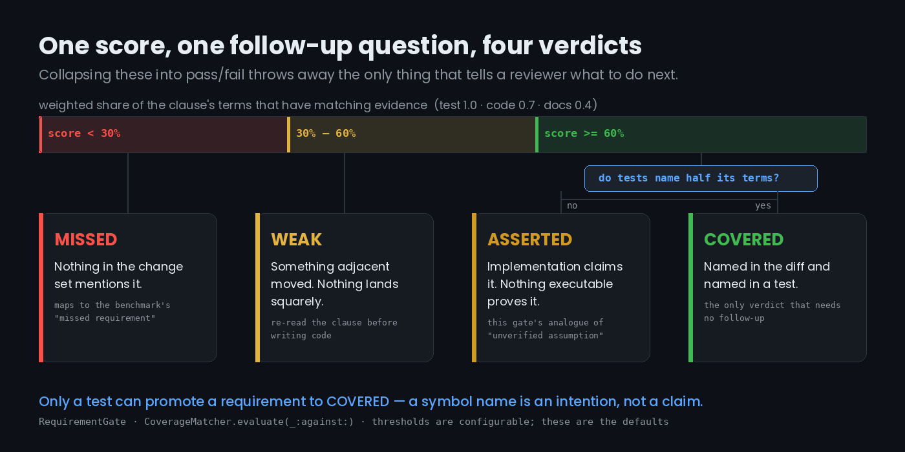
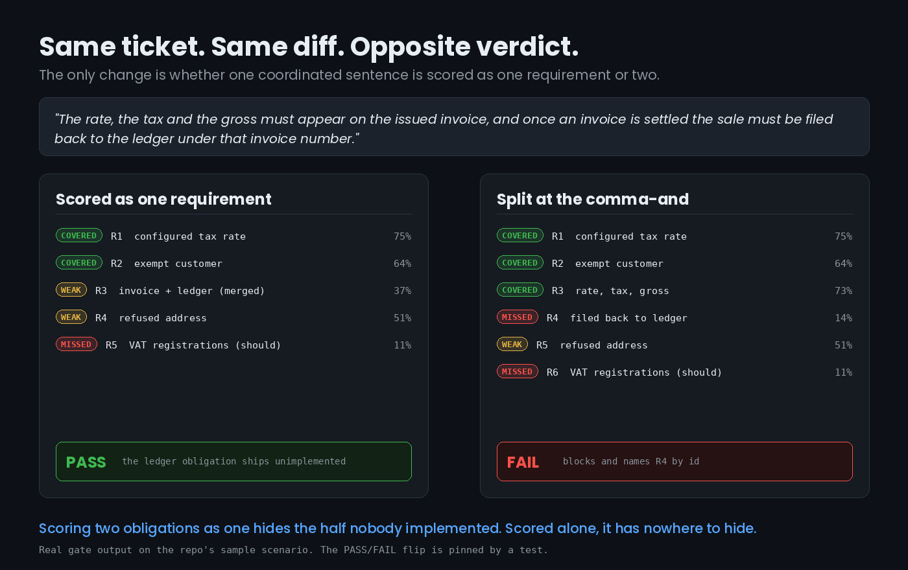

# RequirementGate

A deterministic, offline gate that reads a ticket, reads a change set, and tells you
which obligations in the ticket nothing in the diff accounts for.

It exists because of one finding: when frontier coding agents are benchmarked on
**private, real-world enterprise codebases** rather than public repos, *missed
requirements* is the biggest single bucket of failures in aggregate — and it is the
failure mode a human reviewer is worst at catching, because the reviewer is reading the
diff, not the ticket.



The sample ticket in `SampleScenarios` is adapted from one of Real-SWE's own published
billing tasks, because that task has exactly the shape this library exists for.

---

## The result this repo is built around

Same ticket, same diff. The only variable is whether one coordinated sentence is scored
as one requirement or two:



```text
splitCoordinatedClauses: false
PASS — 5 requirements: 2 covered, 0 asserted, 2 weak, 1 missed, 0 unscorable
[WEAK]   R3 (must, 37%) The rate, the tax and the gross must appear on the issued
                        invoice, and once an invoice is settled the sale must be
                        filed back to the ledger under that invoice number

splitCoordinatedClauses: true
FAIL — 6 requirements: 3 covered, 0 asserted, 1 weak, 2 missed, 0 unscorable
BLOCKING: 1 required clause(s) have no matching evidence: R4.
[COVERED] R3 (must, 73%) The rate, the tax and the gross must appear on the issued invoice
[MISSED]  R4 (must, 14%) once an invoice is settled the sale must be filed back to the
                         ledger under that invoice number
```

Scoring two obligations as one dilutes the matched terms across both halves and hides
the one nobody implemented. That behaviour is pinned by a test, so it cannot quietly
regress:
`testMergingTheCoordinatedClauseLetsTheGateGoGreenOnAHalfDoneTicket`.

---

## What's in it

| Type | What it does |
| --- | --- |
| `RequirementExtractor` | Splits ticket prose into atomic requirements. Promotes list items and acceptance criteria unconditionally, prose only on a modal cue, and splits coordinated predicates on `", and "` / `"; and "` / `"; "` — never on a bare `" and "`. |
| `Lexicon` | Tokenises (including camelCase boundaries), stems with five short documented rules, and matches terms by equality or a short prefix with a length-gap guard. |
| `ChangeSet` / `EvidenceIndex` | Models the change structurally — paths, symbols, test names, doc comments — rather than as raw diff text, and tags each item as `test`, `implementation` or `documentation`. |
| `CoverageMatcher` | Scores each requirement's terms against the evidence and classifies it `covered` / `asserted` / `weak` / `missed` / `unscorable`. |
| `RequirementGate` / `GatePolicy` | Turns findings into a verdict. Ships an `.advisory` policy that reports without blocking. |

### The load-bearing decisions

- **A requirement only reaches `covered` when tests name at least half its terms.** A
  symbol name is an intention; a test name is an executable claim. Strong overlap backed
  only by implementation gets its own verdict, `asserted` — this gate's analogue of the
  benchmark's "unverified assumption" bucket, and a different conversation with the
  author than "you forgot this".
- **Clause splitting is deliberately conservative.** A false split invents a requirement
  that gets reported missing forever, which teaches the team to ignore the gate. A false
  merge hides exactly one item. The costs are asymmetric, so the rules are too.
- **An empty extraction blocks.** A gate that goes green because it parsed nothing is
  worse than no gate — it manufactures confidence.
- **Lexical, not semantic.** No embeddings, no model call. The same ticket and diff
  produce the same verdict on every machine and every run, which is what lets a team
  argue about the requirement instead of about the tool.

---

## Using it

```swift
import RequirementGate

let report = RequirementGate().run(
    ticket: ticketBody,
    changeSet: ChangeSet(files: [
        ChangeSet.File(
            path: "Sources/Billing/LedgerFiling.swift",
            symbols: ["fileSettledSaleToLedger(invoiceNumber:)"]
        ),
        ChangeSet.File(
            path: "Tests/BillingTests/LedgerTests.swift",
            testNames: ["testSettledSaleIsFiledBackToLedgerUnderInvoiceNumber"]
        )
    ])
)

print(report.summaryLine)
guard report.passed else {
    print(report.renderPlainText())
    exit(1)
}
```

Start in advisory mode and watch it for a couple of weeks before you let it block:

```swift
let report = RequirementGate(policy: .advisory).run(ticket: ticketBody, changeSet: changeSet)
```

---

## How to run it

```bash
git clone https://github.com/rajatslakhina/missed-requirements-gate-article-demo.git
cd missed-requirements-gate-article-demo

# The library and its tests
swift build
swift test

# The iOS demo app
open Demo/Demo.xcodeproj    # pick any iOS Simulator, then Build & Run
```

`Demo.xcodeproj` consumes the library through a **local** Swift package reference
(`relativePath = ../`), so there is no second repository to fetch and nothing to resolve
over the network. One clone, one open, one run.

---

## Verification status

Be aware of exactly what has and has not been executed:

| Check | Status |
| --- | --- |
| `swift build` | **Passing** — Swift 6.0.3, Linux aarch64, no warnings from this package's own sources. |
| `swift test` | **Passing — 38 tests, 0 failures.** Covers the extractor, the lexicon, the matcher, the gate policy, and the split-vs-merged counterfactual above. |
| `Demo.xcodeproj` build & run on Simulator | **Not executed.** This repo was produced in an environment with no macOS shell (no `xcodebuild`, no `simctl`) and no permission to drive Xcode, so the app target has never been compiled. |
| `project.pbxproj` | **Hand-authored and statically validated** — balanced braces and parens, all 20 object IDs defined and referenced, no dangling references, scheme XML well-formed, scheme blueprint ID matches the target ID. |
| `RequirementGateDemoView` | **Hand-reviewed, not compiled.** It is guarded by `#if canImport(SwiftUI)`, so the Linux build skips it entirely. |

There are no screenshots in `Demo/Screenshots/` for the same reason. The images in
`Article/` are original diagrams, not device captures, and none of them is presented as
evidence that the app ran.

If you open the demo and it needs a fix, a PR or an issue is genuinely welcome — the
library underneath it is the part that is tested.

---

## Source

The finding this is built on: **Real-SWE** (Specific Labs, September 2026) — eight
model-and-harness configurations, ten tasks drawn from private production codebases,
640 scored rollouts. Top configuration (Fable 5.1 + Claude Code) resolved 38.8% of tasks;
six of the ten tasks came in under 15%. "Missed requirement" is the largest failure
bucket in aggregate, though it leads for only three of the eight configurations.
<https://withspecific.com/benchmarks/real-swe>

Article: [Your Coding Agent Didn't Fail the Ticket. It Only Read Half of One
Sentence.](https://medium.com/@er.rajatlakhina/your-coding-agent-didnt-fail-the-ticket-it-only-read-half-of-one-sentence-71acfdd5c0fa)

## Licence

MIT.
